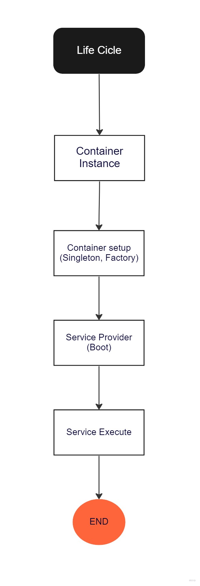
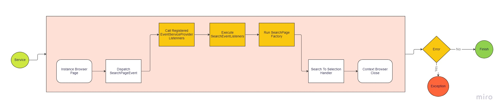
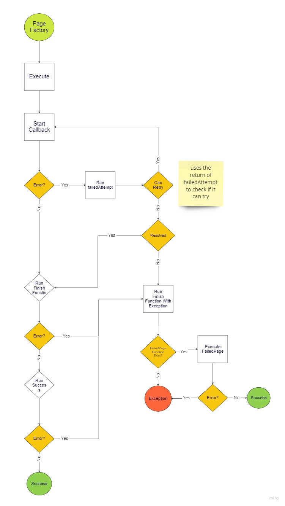
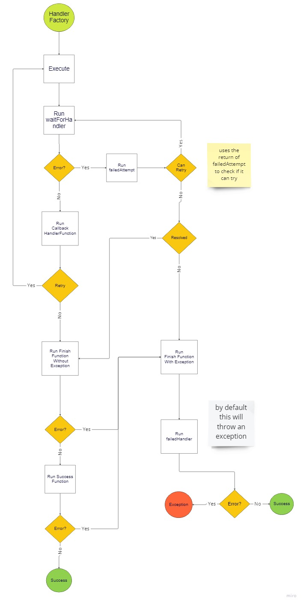

<h1 align="center">
    <a href="https://github.com/ODGodinho">
        
    </a>
    <br />
    Stanley Crawler With Events By Dragons Gamers
    <br />
</h1>

<h4 align="center">Template Stanley for Crawler Puppeteer/Playwright project 🤖!</h4>

<p align="center">

[](https://codecov.io/gh/ODGodinho/Stanley-TheTemplate-Typescript)
[](https://github.com/ODGodinho/Stanley-Crawler-Event/stargazers)
[](https://www.linkedin.com/in/victor-alves-odgodinho/)
[](https://github.com/ODGodinho/Stanley-Crawler-Event/network/members)

[](https://github.com/ODGodinho/Stanley-Crawler-Event/commits/master)
[](https://opensource.org/licenses/MIT)
[](https://github.styleci.io/repos/577106458?branch=main)

</p>

# Table of Contents

- [🎇 Benefits](#-benefits)
- [📗 Libraries](#-libraries)
- [📁 Dependencies](#-dependencies)
- [🔘 Use Template](#-use-template)
  - [🙈 Change to Puppeteer](#-change-to-puppeteer)
- [⏩ Get Started](#-get-started)
  - [🦻 Event / Listeners](#-event-listeners)
  - [↖️ Selector](#-selector)
  - [⚙️ Container Bind](#-container-bind)
  - [❕ Extract Text Helper](#-extract-text-helper)
  - [🟢 Make File](#-make-file)
- [💓 Cycle Time](#-cycle-time)
  - [📽️ Project Life Cycle](#-project-life-cycle)
  - [🐠 Service Life Cycle](#-service-life-cycle)
  - [💦 Page Life Cycle](#-page-life-cycle)
  - [🀄 Handler Life Cycle](#-handler-life-cycle)
- [💻 Prepare to develop](#-prepare-to-develop)
- [📍 Start Project](#-start-project)
- [📨 Build and Run](#-build-and-run)
- [🧪 Teste Code](#-teste-code)

---

## 🎇 Benefits

- 🚀 Speed start new crawler using typescript
- 🚨 Over 800 rules for pattern, possible errors and errors in Linter
- 🎇 Code quality guaranteed
- 📢 AutoReview when opening a pull-request/merge
    
- 🧪 Automatic Test when opening pull-request/merge
- 📈 Automatic Code Coverage when opening pull-request/merge
    
- 📦 Automatic Package and release generate on merge
- 🪝 Run Lint/Test command pre-commit execute
- ⚙️ IOT/IOC (Inversion of Control) for easy use of libraries
- 🟢 Make:Files Command to make base files

## 📗 Libraries

- [Node.js 18](https://nodejs.org/?n=dragonsgamers)
- [Typescript](https://www.typescriptlang.org/?n=dragonsgamers)
- [Eslint](https://eslint.org/?n=dragonsgamers)
- [ODG-Linter-JS](https://github.com/ODGodinho/ODG-Linter-Js?n=dragonsgamers)
- [EditorConfig](https://editorconfig.org/?n=dragonsgamers)
- [ReviewDog](https://github.com/reviewdog/action-eslint)

## 📁 Dependencies

- [Node.js](https://nodejs.org) 18 or later
- [Yarn](https://yarnpkg.com/) Optional/Recommended
- [Playwright](https://playwright.dev/)
  - For web scraping / crawling / automation
- [@odg/axios](https://www.npmjs.com/package/@odg/axios)
  - Example to message request with axios
- [@odg/chemical-x](https://www.npmjs.com/package/@odg/chemical-x)
  - Base For crawlers and helpers project
- [@odg/command](https://www.npmjs.com/package/@odg/command)
  - Commands to make:files
- [@odg/events](https://www.npmjs.com/package/@odg/events)
  - Abstract Events with async events
- [@odg/exception](https://www.npmjs.com/package/@odg/exception)
  - Create custom exception to debug and history
- [@odg/json-log](https://www.npmjs.com/package/@odg/json-log)
  - Convert your logs exception, request, in JSON before send
- [@odg/log](https://www.npmjs.com/package/@odg/log)
  - Interface of logs
- [@odg/message](https://www.npmjs.com/package/@odg/message)
  - Interface of request and messages
- [@odg/tsconfig](https://www.npmjs.com/package/@odg/tsconfig)
  - Base Tsconfig to build project

### 🔘 Use Template

Click in use this template button and clone your template project


#### 🙈 Change to Puppeteer

To change you crawler to use puppeteer you change `./engine.ts` file for:

```typescript
import puppeteer, {
    type Browser,
    type PuppeteerLaunchOptions,
    type Page,
    type BrowserContext,
    type PuppeteerNode,
} from "puppeteer";

import {
    type Context as ContextClass,
    type Browser as BrowserClass,
    type Page as PageClass,
} from "./Browser";

export type BrowserTypeEngine = PuppeteerNode;

export type BrowserClassEngine = Browser;

export type ContextClassEngine = BrowserContext;

export type PageClassEngine = Page;

export type BrowserOptionsEngine = PuppeteerLaunchOptions;

export const browserEngine = puppeteer;
```

## ⏩ Get Started

---

### 🦻 Event / Listeners

Events can be fired with EventBusInterface Example
Include the execution of your page in an event so that you can execute any page at any time

```typescript
export class ExampleEventListener implements EventListenerInterface<EventTypes, EventName.ExampleEvent> {

    @inject(ContainerName.Logger)
    public readonly log!: LoggerInterface;

    public async handler(_receivedData: unknown) {
        await this.log.info('Example Event Listener');
    }

}
```

> Register all Events name in `./src/app/Enums/EventName.ts`
---
> Register all Events Types in `./@types/EventsInterface.ts`
---
> Register your events in EventServiceProvider to automatic listeners.

### ↖️ Selector

The selectors are in the selectors folder

```typescript
export const googleSearchSelector = {
    searchInput: "input[name=\"q\"]",
    buttons: {
        submit: "input[name=\"btnK\"] >> visible=true",
    },
};

export type GoogleSearchSelectorType = typeof googleSearchSelector;
```

> Register all Selectors in `./src/app/Selectors/index.ts`

### ⚙️ Container Bind

```typescript
this.bind(
    ContainerName.Logger,
).to(ConsoleLogger).inSingletonScope();
```

> Register all Container name in `src/app/Enums/ContainerName.ts`
> Register all Container Inject in `src/app/Container.ts`

### ❕ Extract Text Helper

Use Str, Num, Arr helpers class to manipulate Text, Numbers and Arrays

```typescript
import { Str } from "@odg/chemical-x";

const value = new Str(
    this.page.locator("#money").innerText(),
).money();
```

### 🟢 Make File

To Make a file run command

> Use this to make Page, Handler, Selectors...

```powershell
yarn odg make
```

#### Example to make Page File

```powershell
yarn odg make:page Search

# help with
yarn odg make:page --help
```

## 💓 Cycle Time

### 📽️ Project Life Cycle

Project Life cycle



### 🐠 Service Life Cycle

Example Service Life Cycle



### 💦 Page Life Cycle

Example Page Life Cycle



### 🀄 Handler Life Cycle

Example Handler Life Cycle



## 💻 Prepare To Develop

Copy `.env.example` to `.env` and add the values according to your needs.

### 📍 Start Project

First install dependencies with the following command

```bash
yarn install
# or
npm install
```

## 📨 Build and Run

To build the project, you can use the following command

> if you change files, you need to run `yarn build` and `yarn start` again

```bash
yarn build && yarn start
# or
yarn dev
```

## 🧪 Teste Code

To Test execute this command

```bash
yarn test
# or
yarn test:watch
```
